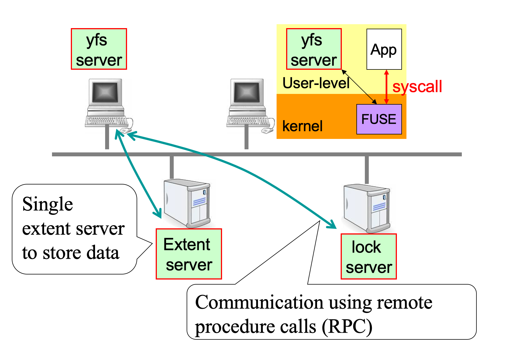

# Naive NFS


> this is a naive network file system, which is a accumulation of four labs from computer system engineer course.

## Installtion
* you will use a computer that has the FUSE module,library,and headers installed.You should be able to install these on your own machine by following the instructions at [fuse.sourceforge.net.](www.fuse.sourceforge.net)
* install docker container in your computer
## Development Setup
```
    % mkdir lab-cse
    % cd lab-cse
    % git clone https://github.com/Guozhi-explore/NFS lab4 -b lab4
    % cd lab1
    % git checkout lab4
    % docker pull ddnirvana/cselab_env:latest
        # suppose the absoulte path of lab-cse is /home/xx/lab-cse
    % sudo docker run -it --privileged --cap-add=ALL -v /home/xx/lab-cse:/home/stu/devlop ddnirvana/cselab_env:latest /bin/bash
        # now you will enter in a container environment, the codes you downloaded in lab-cse will apper in /home/stu/devlop in the container
    %  cd /home/stu/devlop
    %  make
```

## Usage Example
```
    // Evaluation with correcness
    //Testing with RPC_LOSSY=0
    %  export RPC_LOSSY=0
    % ./grade.sh
    //Testing with RPC_LOSSY=5
    % export RPC_LOSSY=5
    % ./grade.sh

    // Evaluation with performance
    % export RPC_COUNT=25
    # ./grade.sh
```

## Release History

### Lab1: Basic File System
* an inode manager to support file system,where following APIs work properly:
```
CREATE,GETATTR
PUT,GET
REMOVE
```
* file system implementation getting the following FUSE operations work:
```
CREATE/MKNOD, LOOKUP, and READDIR
SETATTR, WRITE and READ
MKDIR and UNLINK
SIMBOLIC LINK
```

### Lab2: RPC And Lock Server
* use RPC implemented a single file server
* implememnt a lock server and add locking to ensure that concurrent operations to the same file/directory from different yfs_clients occur one at a time.


### Lab3: Cache for Locks
* Design a protocol for lock server and lock client about lock's acquire and release
    ```
    set of states:
    none: client knows nothing about this lock
    free: client owns the lock and no thread has it
    locked: client owns the lock and a thread has it
    acquiring: the client is acquiring ownership
    releasing: the client is releasing ownership
    ```
* build a lock server and client that cache locks at the client, reducing the load on the server and improving client performance

### Lab4: Cache for Data
* Design a data cache protocol
* Implement data cache bewteen client and file server

## Ackowledge
* Software school of SJTU

